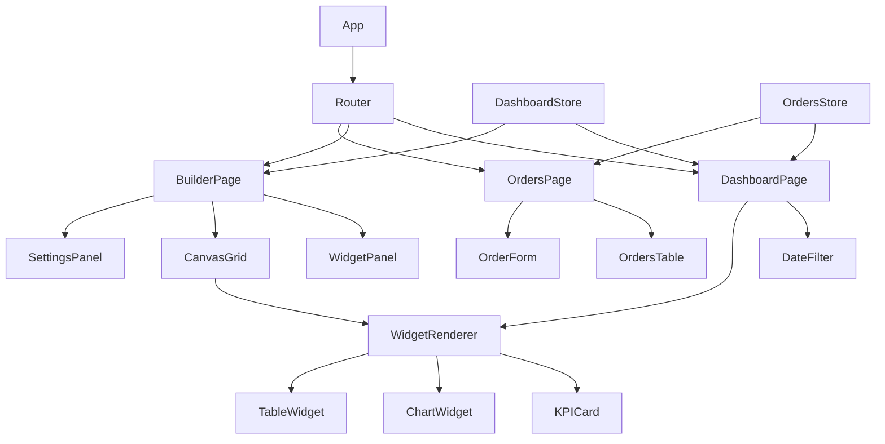

# Design Document: Custom Dashboard Builder

## Overview

The Custom Dashboard Builder is a React 18 + TypeScript single-page application that lets users compose personalized dashboards from a library of widgets (Charts, Tables, KPI Cards), configure each widget's data bindings and appearance, and persist layouts to `localStorage`. A companion Customer Orders module provides the underlying data that all widgets visualize.

The application has two top-level routes:
- `/dashboard` — renders the saved widget layout with a date filter
- `/dashboard/builder` — the drag-and-drop configuration canvas
- `/orders` — the Customer Orders CRUD table

State is managed with Zustand (two stores: `dashboardStore` and `ordersStore`). Recharts handles all chart rendering. `react-grid-layout` drives the drag-and-drop canvas grid. React Hook Form handles the Order Form. TailwindCSS provides styling with the design-system color tokens.

---

## Architecture



### Key Architectural Decisions

- **localStorage persistence**: No backend. `dashboardStore` serializes layout + widget configs on every save action. `ordersStore` serializes orders on every mutation.
- **Single source of truth for orders**: `ordersStore` holds all `CustomerOrder` records. Both the Orders page and all dashboard widgets read from this store, so any CRUD operation is immediately reflected everywhere.
- **Derived data, not stored**: Widget display data (aggregations, filtered rows) is computed at render time from raw orders + current date filter. Nothing is cached in the store.
- **react-grid-layout breakpoints**: The library's `Responsive` variant manages the 12/8/4 column breakpoints natively. We store one layout per breakpoint key (`lg`, `md`, `sm`).

---

## Components and Interfaces

### Application Shell

```
App
├── Sidebar (240px fixed)
│   ├── NavItem (Dashboard)
│   └── NavItem (Customer Orders)
└── <Outlet> (main content area)
```

### Dashboard Page (`/dashboard`)

```
DashboardPage
├── PageHeader
│   ├── PageTitle ("Customer Orders" or custom)
│   └── DateFilter (dropdown: All time | Today | Last 7 | Last 30 | Last 90)
├── EmptyState (shown when no layout saved)
│   └── ConfigureDashboardButton
└── WidgetGrid (react-grid-layout Responsive, read-only)
    └── WidgetRenderer[] (one per saved widget)
        ├── KPICard
        ├── ChartWidget (Bar | Line | Area | Scatter | Pie)
        └── TableWidget
```

### Builder Page (`/dashboard/builder`)

```
BuilderPage
├── BuilderHeader
│   ├── BackButton
│   ├── Title ("Configure Dashboard")
│   └── SaveConfigurationButton
├── WidgetPanel (200px left)
│   └── CategorySection[] (Charts | Tables | KPIs)
│       └── DraggableWidgetType[]
├── CanvasGrid (flex-1, react-grid-layout Responsive)
│   └── WidgetRenderer[] (editable, with hover controls)
│       ├── HoverControls (SettingsIcon | DeleteIcon)
│       └── widget content (preview)
└── SettingsPanel (320px right, slides in)
    ├── KPISettingsForm
    ├── ChartSettingsForm (Bar/Line/Area/Scatter)
    ├── PieSettingsForm
    └── TableSettingsForm
```

### Orders Page (`/orders`)

```
OrdersPage
├── PageHeader
│   ├── PageTitle ("Customer Orders")
│   └── CreateOrderButton
├── EmptyState (when no orders)
└── OrdersTable
    ├── TableHeader (column headers)
    ├── TableRow[] (with context menu trigger)
    │   └── ContextMenu (Edit | Delete)
    ├── StatusBadge (Pending | In Progress | Completed)
    └── Pagination
```

### Order Form (modal)

```
OrderForm (React Hook Form)
├── CustomerInformationSection
│   └── fields: firstName, lastName, email, phone, street, city, state, postalCode, country
└── OrderInformationSection
    └── fields: product, quantity, unitPrice, totalAmount(read-only), status, createdBy
```

---

## Data Models

```typescript
// Customer Order record
interface CustomerOrder {
  id: string;                  // uuid
  customerId: string;          // derived display field
  firstName: string;
  lastName: string;
  email: string;
  phone: string;
  street: string;
  city: string;
  state: string;
  postalCode: string;
  country: string;
  orderId: string;             // uuid
  orderDate: string;           // ISO 8601
  product: string;
  quantity: number;
  unitPrice: number;
  totalAmount: number;         // quantity * unitPrice (computed on save)
  status: 'Pending' | 'In progress' | 'Completed';
  createdBy: string;
}

// Widget types
type WidgetType = 'bar' | 'line' | 'area' | 'scatter' | 'pie' | 'table' | 'kpi';

// Base config shared by all widgets
interface BaseWidgetConfig {
  id: string;
  type: WidgetType;
  title: string;
  description?: string;
  w: number;   // column span
  h: number;   // row span
}

interface KPIConfig extends BaseWidgetConfig {
  type: 'kpi';
  metric: keyof CustomerOrder;
  aggregation: 'Sum' | 'Average' | 'Count';
  dataFormat: 'Number' | 'Currency';
  decimalPrecision: number;
}

interface AxisChartConfig extends BaseWidgetConfig {
  type: 'bar' | 'line' | 'area' | 'scatter';
  xAxis: string;
  yAxis: string;
  color: string;
  showDataLabel: boolean;
}

interface PieChartConfig extends BaseWidgetConfig {
  type: 'pie';
  dataField: string;
  showLegend: boolean;
}

interface TableConfig extends BaseWidgetConfig {
  type: 'table';
  columns: Array<keyof CustomerOrder>;
  sortBy: 'asc' | 'desc' | 'orderDate';
  pageSize: 5 | 10 | 15;
  applyFilter: boolean;
  filters: FilterCondition[];
  fontSize: number;
  headerBackground: string;
}

interface FilterCondition {
  field: keyof CustomerOrder;
  operator: 'equals' | 'contains' | 'gt' | 'lt';
  value: string;
}

type WidgetConfig = KPIConfig | AxisChartConfig | PieChartConfig | TableConfig;

// react-grid-layout position
interface GridItem {
  i: string;   // widget id
  x: number;
  y: number;
  w: number;
  h: number;
}

// Persisted layout (one per breakpoint)
interface DashboardLayout {
  lg: GridItem[];   // 12-col desktop
  md: GridItem[];   // 8-col tablet
  sm: GridItem[];   // 4-col mobile
}

// Full persisted dashboard state
interface DashboardState {
  layout: DashboardLayout;
  widgets: Record<string, WidgetConfig>;
  savedAt: string | null;
}
```

---

## State Management

### `dashboardStore` (Zustand)

```typescript
interface DashboardStore {
  // State
  layout: DashboardLayout;
  widgets: Record<string, WidgetConfig>;
  savedAt: string | null;
  activeWidgetId: string | null;
  dateFilter: DateFilterOption;

  // Actions
  addWidget: (type: WidgetType, position: { x: number; y: number }) => void;
  removeWidget: (id: string) => void;
  updateWidgetConfig: (id: string, config: Partial<WidgetConfig>) => void;
  updateLayout: (breakpoint: string, layout: GridItem[]) => void;
  saveConfiguration: () => void;
  setActiveWidget: (id: string | null) => void;
  setDateFilter: (filter: DateFilterOption) => void;
}

type DateFilterOption = 'all' | 'today' | '7d' | '30d' | '90d';
```

Persistence: `saveConfiguration()` writes `{ layout, widgets, savedAt }` to `localStorage` under key `dashboard_config`. On store init, it hydrates from `localStorage`.

### `ordersStore` (Zustand)

```typescript
interface OrdersStore {
  orders: CustomerOrder[];
  addOrder: (order: Omit<CustomerOrder, 'id' | 'orderId' | 'orderDate' | 'customerId'>) => void;
  updateOrder: (id: string, updates: Partial<CustomerOrder>) => void;
  deleteOrder: (id: string) => void;
}
```

Persistence: every mutation writes `orders` array to `localStorage` under key `customer_orders`. On init, hydrates from `localStorage`.

---

## Key Algorithms

### 1. Date Filter

```typescript
function filterOrdersByDate(orders: CustomerOrder[], filter: DateFilterOption): CustomerOrder[] {
  if (filter === 'all') return orders;
  const now = new Date();
  const cutoff = new Date();
  if (filter === 'today') cutoff.setHours(0, 0, 0, 0);
  else if (filter === '7d') cutoff.setDate(now.getDate() - 7);
  else if (filter === '30d') cutoff.setDate(now.getDate() - 30);
  else if (filter === '90d') cutoff.setDate(now.getDate() - 90);
  return orders.filter(o => new Date(o.orderDate) >= cutoff);
}
```

### 2. KPI Aggregation

```typescript
function aggregateKPI(orders: CustomerOrder[], metric: keyof CustomerOrder, agg: 'Sum' | 'Average' | 'Count'): number {
  if (agg === 'Count') return orders.length;
  const values = orders.map(o => Number(o[metric])).filter(v => !isNaN(v));
  if (agg === 'Sum') return values.reduce((a, b) => a + b, 0);
  if (agg === 'Average') return values.length ? values.reduce((a, b) => a + b, 0) / values.length : 0;
  return 0;
}
```

### 3. Responsive Grid Reflow

`react-grid-layout`'s `<Responsive>` component handles breakpoint switching automatically. We configure:

```typescript
const breakpoints = { lg: 1024, md: 768, sm: 0 };
const cols = { lg: 12, md: 8, sm: 4 };
```

When the viewport crosses a breakpoint, the library switches to the corresponding layout array. For the `sm` breakpoint, we override all items to `{ x: 0, w: 4 }` (full width, stacked) by deriving the `sm` layout from `lg` on save.

### 4. Table Filtering

```typescript
function applyFilters(orders: CustomerOrder[], conditions: FilterCondition[]): CustomerOrder[] {
  return orders.filter(order =>
    conditions.every(cond => {
      const val = String(order[cond.field]).toLowerCase();
      const target = cond.value.toLowerCase();
      switch (cond.operator) {
        case 'equals': return val === target;
        case 'contains': return val.includes(target);
        case 'gt': return Number(order[cond.field]) > Number(cond.value);
        case 'lt': return Number(order[cond.field]) < Number(cond.value);
        default: return true;
      }
    })
  );
}
```

### 5. Pie Chart Data Grouping

```typescript
function groupByField(orders: CustomerOrder[], field: keyof CustomerOrder): { name: string; value: number }[] {
  const counts: Record<string, number> = {};
  for (const order of orders) {
    const key = String(order[field]);
    counts[key] = (counts[key] ?? 0) + 1;
  }
  return Object.entries(counts).map(([name, value]) => ({ name, value }));
}
```

---

## Routing Structure

```
/                     → redirect to /dashboard
/dashboard            → DashboardPage
/dashboard/builder    → BuilderPage
/orders               → OrdersPage
```

React Router v6 with a root layout component that renders the `Sidebar` + `<Outlet>`.

---

## Error Handling

- **Empty/invalid form fields**: React Hook Form validation with inline error messages ("Please fill the field") rendered below each field in `#ef4444`.
- **Non-numeric metric + Sum/Average**: KPI settings panel disables Sum/Average options and forces Count when a non-numeric metric is selected. This is enforced in the UI and in `aggregateKPI` (returns `orders.length` for Count regardless).
- **Widget dropped outside canvas**: `react-grid-layout` fires `onDrop` only within the grid bounds; drops outside are ignored by not registering an `onDrop` handler outside the grid container.
- **localStorage unavailable**: Wrap all `localStorage` calls in try/catch; fall back to in-memory state with a console warning.
- **Missing saved layout**: On `DashboardPage` mount, if `localStorage` has no `dashboard_config` key, render the empty state with the "Configure Dashboard" button.

---

## Testing Strategy

### Unit Tests (Vitest)

Focus on pure functions and specific examples:
- `filterOrdersByDate` with each filter option
- `aggregateKPI` for Sum, Average, Count with known inputs
- `applyFilters` with each operator
- `groupByField` with known data
- Order Form validation: empty fields, total amount auto-calculation
- KPI format: Currency prefix, decimal precision

### Property-Based Tests (fast-check)

Each property test runs a minimum of 100 iterations. Tests are tagged with:
`// Feature: custom-dashboard-builder, Property N: <property text>`


---

## Correctness Properties

*A property is a characteristic or behavior that should hold true across all valid executions of a system — essentially, a formal statement about what the system should do. Properties serve as the bridge between human-readable specifications and machine-verifiable correctness guarantees.*

### Property 1: Widget addition grows the layout

*For any* dashboard layout and any valid widget type dragged to a valid grid position, after the drop the layout's widget count should be exactly one greater than before.

**Validates: Requirements 2.2**

---

### Property 2: Widget deletion removes the widget

*For any* dashboard layout containing at least one widget, after confirming deletion of a widget that widget's id should no longer appear in the layout or the widgets map.

**Validates: Requirements 4.4**

---

### Property 3: Widget resize updates grid dimensions

*For any* widget in the layout and any valid width (≥ 1) and height (≥ 1) values saved through the Settings Panel, the widget's stored `w` and `h` in the layout should equal the saved values.

**Validates: Requirements 5.1, 5.2, 5.3**

---

### Property 4: Layout persistence round-trip

*For any* dashboard layout and widget configuration map, serializing to localStorage via `saveConfiguration` and then re-hydrating the store should produce a state equal to the original.

**Validates: Requirements 6.2, 6.3**

---

### Property 5: Date filter excludes out-of-range orders

*For any* collection of customer orders and any date filter option (Today, Last 7 Days, Last 30 Days, Last 90 Days), every order returned by `filterOrdersByDate` should have an `orderDate` within the selected range, and every order outside the range should be excluded.

**Validates: Requirements 7.2**

---

### Property 6: Non-numeric metric forces Count aggregation

*For any* KPI card configuration where the selected metric is a non-numeric field (Customer ID, Customer name, Email, Address, Order date, Product, Created by, Status), the effective aggregation used by `aggregateKPI` should always be Count regardless of the configured aggregation value.

**Validates: Requirements 8.2**

---

### Property 7: KPI aggregation and formatting correctness

*For any* collection of orders, numeric metric, aggregation type (Sum/Average/Count), data format (Number/Currency), and decimal precision, the formatted KPI value should equal the correctly aggregated number rounded to the specified precision, and if the format is Currency the string should start with "$".

**Validates: Requirements 8.3, 8.4**

---

### Property 8: Axis chart config is applied to rendered data

*For any* axis-based chart widget configuration (Bar, Line, Area, Scatter) with valid xAxis and yAxis fields, the data passed to the Recharts component should use those fields as keys, the series color should match the configured color, and data labels should be present if and only if `showDataLabel` is true.

**Validates: Requirements 9.2, 9.3, 9.4**

---

### Property 9: Pie chart groups by distinct values

*For any* collection of orders and any grouping field, the data produced by `groupByField` should contain exactly one entry per distinct value of that field, each entry's `value` should equal the count of orders with that field value, and the sum of all values should equal the total number of orders. The legend should be present in the rendered output if and only if `showLegend` is true.

**Validates: Requirements 10.2, 10.3**

---

### Property 10: Table column selection filters columns

*For any* table widget configuration with a chosen subset of columns, every row rendered by the table should contain data only for the selected columns and no others.

**Validates: Requirements 11.3**

---

### Property 11: Table sort produces ordered rows

*For any* collection of orders and any sort option (asc, desc, orderDate), the rows returned by the table's sort function should be in the correct order: ascending by the sort key for "asc", descending for "desc", and chronological by `orderDate` for "orderDate".

**Validates: Requirements 11.4**

---

### Property 12: Table pagination limits rows per page

*For any* collection of orders and any page size (5, 10, or 15), the number of rows on any page should be at most the configured page size, and the union of all pages should equal the full (filtered) order set.

**Validates: Requirements 11.5**

---

### Property 13: Table filter excludes non-matching records

*For any* collection of orders and any set of filter conditions, every row returned by `applyFilters` should satisfy all conditions simultaneously, and no row that fails any condition should appear.

**Validates: Requirements 11.6**

---

### Property 14: Order store mutation is reflected in widget data

*For any* orders store state and any mutation (add, update, or delete), the widget data derived from the store after the mutation should reflect the new store state — i.e., added orders appear, updated orders show new values, and deleted orders are absent.

**Validates: Requirements 12.2**

---

### Property 15: Total amount equals quantity × unit price

*For any* quantity (≥ 1) and unit price (≥ 0), the `totalAmount` computed by the Order Form should equal `quantity * unitPrice` rounded to two decimal places.

**Validates: Requirements 14.2**

---

### Property 16: Order form rejects submissions with empty mandatory fields

*For any* order form submission where at least one mandatory field is empty or whitespace-only, the form should not add a record to the orders store and should produce a validation error for each empty mandatory field.

**Validates: Requirements 14.3**

---

### Property 17: Order creation round-trip

*For any* valid order form data, after successful submission the orders store should contain a record whose field values match the submitted form data (excluding auto-generated id/orderId/orderDate).

**Validates: Requirements 14.4**

---

### Property 18: Edit form pre-population

*For any* existing order record, opening the edit form should populate every form field with the corresponding value from that record.

**Validates: Requirements 15.2**

---

### Property 19: Order update round-trip

*For any* existing order and any valid set of updated field values, after submitting the edit form the orders store should contain exactly one record with the original id whose fields reflect the updated values.

**Validates: Requirements 15.3**

---

### Property 20: Order deletion removes the record

*For any* orders store containing at least one record, after confirming deletion of a record that record's id should no longer appear in the store, and all other records should remain unchanged.

**Validates: Requirements 15.5**

---

### Property 21: Tablet reflow — no widget exceeds available columns

*For any* set of widgets with arbitrary column spans, when the grid switches to the 8-column (tablet) breakpoint, no widget's `x + w` should exceed 8, and any widget that would overflow should be reflowed to the next row.

**Validates: Requirements 3.4, 16.2**

---

### Property 22: Mobile layout stacks all widgets

*For any* set of widgets, when the grid switches to the 4-column (mobile) breakpoint, every widget should have `x = 0` and `w = 4` (full width), and widgets should be stacked vertically with non-overlapping y positions.

**Validates: Requirements 3.5, 16.3**

---

## Testing Strategy

### Unit Tests (Vitest)

Unit tests cover specific examples, edge cases, and integration points:

- `filterOrdersByDate`: one test per filter option with known order dates; edge case: empty orders array
- `aggregateKPI`: Sum/Average/Count with known numeric inputs; edge case: empty orders (Average → 0)
- `applyFilters`: each operator (equals, contains, gt, lt); multiple conditions (AND logic); empty conditions array returns all rows
- `groupByField`: known data with repeated values; single-value field; all-unique values
- Order Form validation: each mandatory field empty individually; all fields empty; valid submission
- Total amount calculation: integer inputs, decimal inputs, zero unit price
- KPI formatting: Currency prefix, decimal precision rounding, Number format (no prefix)
- `localStorage` hydration: valid JSON, missing key (empty state), malformed JSON (graceful fallback)

### Property-Based Tests (fast-check)

Library: **fast-check** (TypeScript-native, works with Vitest).

Each test runs a minimum of **100 iterations** (`{ numRuns: 100 }`). Each test is tagged:

```typescript
// Feature: custom-dashboard-builder, Property N: <property text>
```

One property-based test per correctness property above. Key generators needed:

- `fc.record(...)` for `CustomerOrder` with realistic field distributions
- `fc.array(orderArb, { minLength: 0, maxLength: 50 })` for order collections
- `fc.constantFrom('all', 'today', '7d', '30d', '90d')` for date filter options
- `fc.constantFrom('Sum', 'Average', 'Count')` for aggregation
- `fc.constantFrom('Number', 'Currency')` for data format
- `fc.integer({ min: 0, max: 10 })` for decimal precision
- `fc.constantFrom('bar', 'line', 'area', 'scatter', 'pie', 'table', 'kpi')` for widget types
- `fc.integer({ min: 1, max: 12 })` for column spans
- `fc.constantFrom(5, 10, 15)` for page sizes

Both unit tests and property tests are complementary: unit tests catch concrete bugs with known inputs, property tests verify general correctness across the input space.
